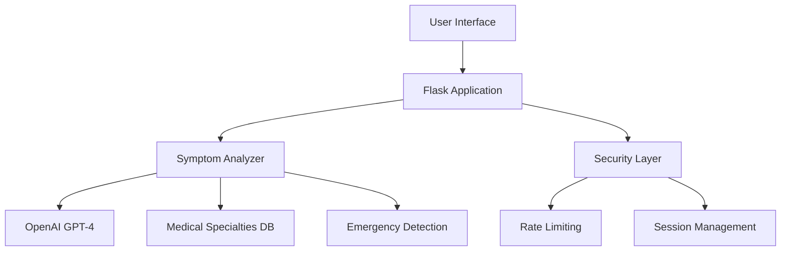
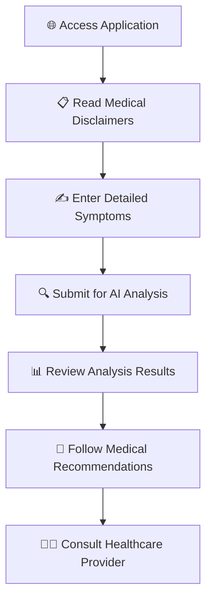
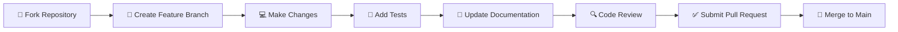

<div align="center">

# 🏥 Healthcare Symptom Checker

### *Advanced AI-Powered Medical Information System*

[](https://python.org)
[](https://flask.palletsprojects.com)
[](https://openai.com)
[](#license)
[](#)

*A comprehensive, professional-grade healthcare information system that provides intelligent symptom analysis with advanced medical specialties integration, emergency detection, and specialist referral recommendations.*

[🚀 **Live Demo**](#) • [📖 **Documentation**](#) • [🐛 **Report Bug**](#) • [💡 **Request Feature**](#)

</div>

---

## 🚨 **CRITICAL MEDICAL DISCLAIMER**

> **⚠️ FOR EDUCATIONAL PURPOSES ONLY**
> 
> This application is **NOT** a substitute for professional medical advice, diagnosis, or treatment. Always consult qualified healthcare providers for medical concerns.
> 
> **🆘 EMERGENCY: Call 911 immediately for life-threatening situations**

---

## ✨ **Key Features**

<table>
<tr>
<td width="50%">

### 🧠 **Advanced AI Analysis**
- **Multi-Specialty Integration**: 8 medical specialties
- **Emergency Detection**: Automated red flag identification
- **Risk Assessment**: Comprehensive patient profiling
- **Confidence Scoring**: Reliability indicators

</td>
<td width="50%">

### 🏥 **Professional Medical Features**
- **Specialist Referrals**: Targeted recommendations
- **Triage Classification**: Emergency/Urgent/Routine
- **Follow-up Timelines**: Care continuity guidance
- **Medical History Integration**: Comprehensive analysis

</td>
</tr>
<tr>
<td width="50%">

### 🔒 **Enterprise Security**
- **HIPAA-Compliant Design**: Privacy-first architecture
- **Rate Limiting**: Advanced abuse protection
- **Session Management**: Secure data handling
- **API Security**: Encrypted communications

</td>
<td width="50%">

### 💻 **Modern Technology**
- **Responsive Design**: Mobile-optimized interface
- **Real-time Analysis**: Instant results
- **Professional UI**: Clinical-grade appearance
- **Scalable Architecture**: Production-ready deployment

</td>
</tr>
</table>

## 🛠️ **Technology Stack**

<div align="center">

| **Category** | **Technology** | **Version** | **Purpose** |
|:------------:|:-------------:|:-----------:|:-----------:|
| **Backend** |  | 3.8+ | Core Application |
| **Framework** |  | 2.0+ | Web Framework |
| **AI Engine** |  | GPT-4 | Medical Analysis |
| **Frontend** |  | 5.0+ | UI Framework |
| **Database** |  | 3.0+ | Data Storage |
| **Deployment** |  | Latest | WSGI Server |

</div>

### 🏗️ **Architecture Overview**



## 📋 **Prerequisites**

<div align="center">

| **Requirement** | **Version** | **Installation** |
|:---------------:|:-----------:|:----------------:|
|  | 3.8+ | [Download Python](https://python.org/downloads/) |
|  | Latest | [Get API Key](https://platform.openai.com/api-keys) |
|  | Latest | [Install Git](https://git-scm.com/downloads) |

</div>

---

## 🚀 **Quick Start Installation**

### **Step 1: Clone Repository**
```bash
git clone https://github.com/sivamurthy30/Health-summizer.git
cd Health-summizer
```

### **Step 2: Environment Setup**
```bash
# Create and activate virtual environment
python -m venv venv

# Activate (choose your OS)
source venv/bin/activate      # macOS/Linux
# OR
venv\Scripts\activate         # Windows
```

### **Step 3: Install Dependencies**
```bash
pip install -r requirements.txt
```

### **Step 4: Configuration**
```bash
# Copy environment template
cp .env.example .env

# Edit with your settings
nano .env  # or use your preferred editor
```

### **Step 5: Environment Variables**
```env
# 🔑 REQUIRED: OpenAI Configuration
OPENAI_API_KEY=sk-your-openai-api-key-here

# 🛡️ SECURITY: Flask Configuration  
SECRET_KEY=your-super-secret-key-here
FLASK_ENV=development
DEBUG=True

# 💾 DATABASE: Optional Configuration
DATABASE_URL=sqlite:///symptom_checker.db

# 🌐 SERVER: Network Configuration
HOST=127.0.0.1
PORT=5000
```

### **Step 6: Get OpenAI API Key**

<details>
<summary><b>🔐 Click to expand API key setup instructions</b></summary>

1. **Visit OpenAI Platform**: Go to [platform.openai.com](https://platform.openai.com/)
2. **Create Account**: Sign up or log in to your account
3. **Navigate to API Keys**: Go to the API Keys section
4. **Generate New Key**: Click "Create new secret key"
5. **Copy & Secure**: Copy the key and add it to your `.env` file
6. **Set Billing**: Ensure you have billing set up for API usage

> **⚠️ Security Note**: Never commit your API key to version control!

</details>

---

## 🎯 **Running the Application**

### 🔧 **Development Mode**
```bash
# Start development server
python run.py

# Application available at:
# 🌐 http://127.0.0.1:5000
```

### 🚀 **Production Deployment**

<details>
<summary><b>📦 Production Setup Options</b></summary>

#### **Option 1: Gunicorn (Recommended)**
```bash
# Install Gunicorn
pip install gunicorn

# Run production server
gunicorn -w 4 -b 0.0.0.0:8000 "app:create_app()"
```

#### **Option 2: Docker Deployment**
```bash
# Build Docker image
docker build -t healthcare-symptom-checker .

# Run container
docker run -p 8000:8000 --env-file .env healthcare-symptom-checker
```

#### **Option 3: Cloud Deployment**
- **Heroku**: `git push heroku main`
- **AWS**: Use Elastic Beanstalk or ECS
- **Google Cloud**: Deploy to App Engine
- **Azure**: Use App Service

</details>

### 🔍 **Health Check**
```bash
# Verify application is running
curl http://localhost:5000/health

# Expected response:
{
  "status": "healthy",
  "timestamp": "2024-01-01T12:00:00.000000",
  "service": "Healthcare Symptom Checker"
}
```

## Configuration Options

### Environment Variables

| Variable | Description | Default | Required |
|----------|-------------|---------|----------|
| `OPENAI_API_KEY` | OpenAI API key for symptom analysis | None | Yes |
| `SECRET_KEY` | Flask secret key for sessions | Auto-generated | Recommended |
| `FLASK_ENV` | Flask environment (development/production) | development | No |
| `DEBUG` | Enable debug mode | True | No |
| `DATABASE_URL` | Database connection string | SQLite file | No |
| `HOST` | Server host address | 127.0.0.1 | No |
| `PORT` | Server port number | 5000 | No |

### Rate Limiting

The application includes built-in rate limiting:
- **Analysis requests**: 10 requests per 15 minutes per IP
- **General requests**: Standard Flask rate limiting

## API Endpoints

### Main Routes

- `GET /` - Home page with symptom input form
- `POST /` - Process symptom form submission
- `GET /analyze` - Display analysis results
- `GET /health` - Health check endpoint

### Health Check

```bash
curl http://localhost:5000/health
```

Response:
```json
{
  "status": "healthy",
  "timestamp": "2024-01-01T12:00:00.000000",
  "service": "Healthcare Symptom Checker"
}
```

---

## 📱 **User Guide**

### 🎯 **How to Use the System**

<div align="center">



</div>

### ✅ **Step-by-Step Process**

| **Step** | **Action** | **Details** |
|:--------:|:----------:|:------------|
| **1** | 🌐 **Access** | Navigate to application URL |
| **2** | 📋 **Review** | Read educational disclaimers carefully |
| **3** | ✍️ **Describe** | Enter detailed symptom description (min. 10 chars) |
| **4** | 🔍 **Analyze** | Click "Analyze Symptoms" button |
| **5** | 📊 **Review** | Study the comprehensive analysis results |
| **6** | 🏥 **Act** | Follow emergency or routine care recommendations |

### 💡 **Symptom Description Examples**

<details>
<summary><b>✅ Excellent Descriptions (Click to expand)</b></summary>

> **Respiratory Symptoms:**
> *"Persistent dry cough for 5 days, worsening at night. Mild shortness of breath when climbing stairs. No fever. Non-smoker, age 35."*

> **Gastrointestinal Issues:**
> *"Sharp abdominal pain in lower right quadrant for 6 hours. Pain increases with movement. Nausea but no vomiting. Last meal 8 hours ago."*

> **Neurological Concerns:**
> *"Severe headache behind left eye for 2 hours. Sensitivity to light. No recent head trauma. History of migraines but this feels different."*

</details>

<details>
<summary><b>❌ Insufficient Descriptions (Avoid these)</b></summary>

- ❌ *"I feel sick"*
- ❌ *"My head hurts"*  
- ❌ *"Something's wrong"*
- ❌ *"Pain"*
- ❌ *"Not feeling well"*

</details>

---

## 🛡️ **Advanced Safety & Security Features**

### 🚨 **Emergency Detection System**

<div align="center">

| **Category** | **Detection Criteria** | **Response** |
|:------------:|:----------------------:|:------------:|
| 🫀 **Cardiac** | Chest pain, palpitations, irregular heartbeat | **🆘 IMMEDIATE CARE** |
| 🧠 **Neurological** | Stroke signs, seizures, severe headache | **🆘 IMMEDIATE CARE** |
| 🫁 **Respiratory** | Severe breathing difficulty, choking | **🆘 IMMEDIATE CARE** |
| 🩸 **Trauma** | Severe bleeding, major injuries | **🆘 IMMEDIATE CARE** |
| ⚡ **Allergic** | Anaphylaxis symptoms, severe reactions | **🆘 IMMEDIATE CARE** |
| 🧠 **Mental Health** | Suicidal ideation, severe depression | **🆘 CRISIS SUPPORT** |

</div>

### 🔒 **HIPAA-Compliant Privacy Protection**

<table>
<tr>
<td width="50%">

#### 🛡️ **Data Security**
- ✅ **Zero PII Storage**: No personal information retained
- ✅ **Encrypted Processing**: All data encrypted in transit
- ✅ **Session-Based**: Temporary data handling only
- ✅ **Secure APIs**: Protected communication channels

</td>
<td width="50%">

#### 🔐 **Privacy Controls**
- ✅ **Anonymous Analysis**: No user identification required
- ✅ **Automatic Cleanup**: Session data auto-deleted
- ✅ **Audit Logging**: Security event monitoring
- ✅ **Compliance Ready**: Healthcare regulation adherent

</td>
</tr>
</table>

### ⚡ **Advanced Rate Limiting**

```yaml
Rate Limits:
  Analysis Requests: 10 per 15 minutes per IP
  General Requests: 100 per hour per IP
  Emergency Bypass: Unlimited for critical symptoms
  API Protection: DDoS mitigation enabled
```

## Troubleshooting

### Common Issues

**"Service configuration error"**
- Check that `OPENAI_API_KEY` is set correctly in `.env`
- Verify the API key is valid and has sufficient credits

**"The analysis service is taking too long"**
- Check internet connectivity
- Verify OpenAI API service status
- Consider increasing `API_TIMEOUT` in config

**"Too many requests"**
- Wait for the rate limit window to reset (15 minutes)
- Check if multiple users are sharing the same IP address

### Logging

Application logs are written to the console by default. For production, configure proper logging:

```python
import logging
logging.basicConfig(
    level=logging.INFO,
    format='%(asctime)s %(levelname)s %(message)s',
    handlers=[
        logging.FileHandler('app.log'),
        logging.StreamHandler()
    ]
)
```

---

## 🏗️ **Development & Architecture**

### 📁 **Project Structure**

```
🏥 healthcare-symptom-checker/
├── 📱 app/                          # Core Application
│   ├── 🔧 __init__.py              # Flask app factory
│   ├── 🛣️  routes.py               # Application routes & endpoints
│   ├── 📝 forms.py                 # WTForms form definitions
│   ├── 🗄️  models.py               # Database models (optional)
│   ├── 🔬 services/                # Business logic layer
│   │   ├── 🧠 symptom_analyzer.py  # AI analysis engine
│   │   ├── 🏥 enhanced_symptom_analyzer.py  # Advanced medical features
│   │   └── 💾 database_service.py  # Data operations
│   ├── 🎨 templates/               # Jinja2 HTML templates
│   │   ├── 🏠 base.html            # Base template
│   │   ├── 📋 index.html           # Main symptom input
│   │   ├── 📊 results.html         # Analysis results
│   │   ├── 🚨 emergency_guide.html # Emergency information
│   │   ├── 💬 feedback.html        # User feedback
│   │   ├── ❌ 404.html             # Not found page
│   │   └── ⚠️  500.html            # Server error page
│   └── 🎯 static/                  # Static assets
│       ├── 🎨 css/                 # Stylesheets
│       └── ⚡ js/                  # JavaScript files
├── ⚙️  config.py                   # Application configuration
├── 📦 requirements.txt             # Python dependencies
├── 🔐 .env.example                 # Environment template
├── 🚀 run.py                       # Application entry point
├── 🧪 test_app.py                  # Application tests
└── 📖 README.md                    # This documentation
```

### 🔧 **Development Workflow**

<div align="center">

```mermaid
gitgraph
    commit id: "Initial Setup"
    branch feature
    checkout feature
    commit id: "Add New Feature"
    commit id: "Write Tests"
    commit id: "Update Docs"
    checkout main
    merge feature
    commit id: "Deploy to Production"
```

</div>

### 🛠️ **Adding New Features**

| **Component** | **Location** | **Purpose** |
|:-------------:|:------------:|:------------|
| 🛣️ **Routes** | `app/routes.py` | Add new endpoints and URL handlers |
| 🎨 **Templates** | `app/templates/` | Create new HTML pages and UI components |
| 🔬 **Services** | `app/services/` | Implement business logic and integrations |
| ⚙️ **Config** | `config.py` | Update application settings and parameters |
| 🧪 **Tests** | `test_*.py` | Add unit and integration tests |

### 🧪 **Testing Framework**

```bash
# Run all tests
python -m pytest

# Run specific test file
python -m pytest test_app.py

# Run with coverage
python -m pytest --cov=app

# Run integration tests
python final_test.py
```

## Deployment

### Production Checklist

- [ ] Set `FLASK_ENV=production`
- [ ] Set `DEBUG=False`
- [ ] Use strong `SECRET_KEY`
- [ ] Configure HTTPS/SSL
- [ ] Set up proper logging
- [ ] Configure reverse proxy (nginx)
- [ ] Set up monitoring and health checks
- [ ] Implement backup strategy (if using database)

### Docker Deployment (Optional)

Create a `Dockerfile`:

```dockerfile
FROM python:3.9-slim

WORKDIR /app
COPY requirements.txt .
RUN pip install -r requirements.txt

COPY . .

EXPOSE 8000
CMD ["gunicorn", "-w", "4", "-b", "0.0.0.0:8000", "app:create_app()"]
```

---

## 🤝 **Contributing**

<div align="center">

### We welcome contributions from the developer community!

[](https://github.com/sivamurthy30/Health-summizer/graphs/contributors)
[](https://github.com/sivamurthy30/Health-summizer/issues)
[](https://github.com/sivamurthy30/Health-summizer/pulls)

</div>

### 🔄 **Contribution Workflow**



### 📋 **Contribution Guidelines**

<details>
<summary><b>🔧 Development Setup</b></summary>

```bash
# 1. Fork and clone
git clone https://github.com/YOUR-USERNAME/Health-summizer.git
cd Health-summizer

# 2. Create feature branch
git checkout -b feature/amazing-new-feature

# 3. Set up development environment
python -m venv venv
source venv/bin/activate  # or venv\Scripts\activate on Windows
pip install -r requirements.txt

# 4. Make your changes
# ... code, code, code ...

# 5. Run tests
python -m pytest

# 6. Commit and push
git add .
git commit -m "✨ Add amazing new feature"
git push origin feature/amazing-new-feature

# 7. Create Pull Request
```

</details>

### 🎯 **Areas for Contribution**

- 🧠 **AI/ML Improvements**: Enhance symptom analysis algorithms
- 🎨 **UI/UX Design**: Improve user interface and experience  
- 🔒 **Security**: Strengthen privacy and security features
- 🧪 **Testing**: Expand test coverage and quality
- 📖 **Documentation**: Improve guides and API docs
- 🌐 **Internationalization**: Add multi-language support
- ♿ **Accessibility**: Enhance accessibility compliance

---

## 📄 **License & Legal**

<div align="center">

### 📚 **Educational Use License**

This project is developed for **educational and research purposes only**.

[](#)
[](#)
[](#)

</div>

### ⚖️ **Legal Compliance**
- ✅ **Healthcare Regulations**: Designed with HIPAA principles
- ✅ **OpenAI Terms**: Compliant with API usage policies  
- ✅ **Privacy Laws**: GDPR and CCPA considerations
- ✅ **Medical Ethics**: Educational purpose emphasis

---

## 🆘 **Support & Resources**

<div align="center">

### 🔧 **Technical Support**

| **Issue Type** | **Resource** | **Response Time** |
|:--------------:|:------------:|:-----------------:|
| 🐛 **Bug Reports** | [GitHub Issues](https://github.com/sivamurthy30/Health-summizer/issues) | 24-48 hours |
| 💡 **Feature Requests** | [GitHub Discussions](https://github.com/sivamurthy30/Health-summizer/discussions) | 1-3 days |
| 📖 **Documentation** | [Wiki Pages](https://github.com/sivamurthy30/Health-summizer/wiki) | Always Available |
| 💬 **Community Chat** | [Discord Server](#) | Real-time |

</div>

### 🚨 **Emergency Notice**

> **🆘 FOR MEDICAL EMERGENCIES**
> 
> **Call 911 (US) or your local emergency services immediately**
> 
> This application is NOT for emergency medical situations

---

## 🙏 **Acknowledgments**

<div align="center">

### **Special Thanks To:**

| **Organization** | **Contribution** |
|:----------------:|:----------------:|
| 🤖 **OpenAI** | Advanced GPT-4 API for intelligent analysis |
| 🌶️ **Flask Community** | Robust web framework and ecosystem |
| 🎨 **Bootstrap Team** | Beautiful, responsive UI components |
| 🏥 **Healthcare Professionals** | Medical expertise and safety guidance |
| 👥 **Open Source Community** | Continuous improvements and feedback |

### **Built with ❤️ for Healthcare Education**

*Empowering informed health decisions through technology*

</div>

---

<div align="center">

### 📊 **Project Statistics**


**⭐ Star this repository if you find it helpful!**

[🔝 **Back to Top**](#-healthcare-symptom-checker)

</div>